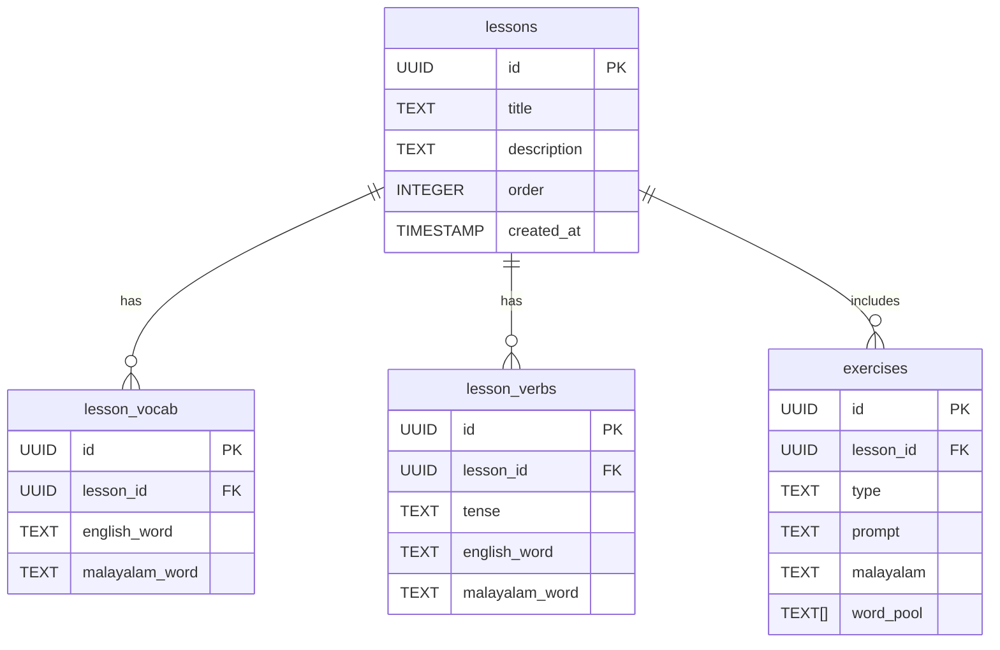

# Mala Lingo

A full-stack application built with Vue 3, FastAPI, and Supabase.

## Project Structure

```
mala-lingo/
├── frontend/          # Vue 3 frontend application
│   ├── Dockerfile     # Production Dockerfile
│   ├── Dockerfile.dev # Development Dockerfile
│   ├── nginx.conf     # Nginx configuration
│   └── vite.config.js # Vite configuration
├── backend/           # FastAPI backend application
│   ├── Dockerfile     # Production Dockerfile
│   └── Dockerfile.dev # Development Dockerfile
├── sheets-sync/       # Google Sheets sync service
│   ├── Dockerfile     # Dockerfile for sync service
│   ├── requirements.txt # Python dependencies
│   └── sync_sheets_data.py # Sync script
├── docker-compose.yml # Docker Compose for development
├── docker-compose.prod.yml # Docker Compose for production
├── docker-dev.sh      # Docker development helper script
├── .env              # Environment variables for development
├── .env.production   # Environment variables for production
└── README.md         # This file
```

## Prerequisites

- Node.js (v16 or higher)
- Python (v3.8 or higher)
- Supabase account
- Docker and Docker Compose

## Setup Instructions

### Using Docker (Recommended)

#### Development Environment

1. Set up environment variables:
```bash
cp .env.example .env
# Edit .env with your Supabase credentials
```

2. Start the development environment using the helper script:
```bash
./docker-dev.sh start
```

Or manually:
```bash
docker-compose up -d
```

The application will be available at:
- Frontend: http://localhost:5173
- Backend: http://localhost:8000

#### Docker Development Helper

We provide a helper script to make Docker operations easier:

```bash
./docker-dev.sh [command]
```

Available commands:
- `start` - Start the development environment
- `stop` - Stop the development environment
- `restart` - Restart the development environment
- `logs` - Show logs from all containers
- `frontend` - Show logs from the frontend container
- `backend` - Show logs from the backend container
- `rebuild` - Rebuild and restart the containers
- `clean` - Remove all containers and volumes
- `help` - Show help message

#### Production Environment

1. Set up environment variables:
```bash
cp .env.example .env.production
# Edit .env.production with your production Supabase credentials
```

2. Build and start the production environment:
```bash
docker-compose -f docker-compose.prod.yml --env-file .env.production up -d
```

The application will be available at:
- Frontend: http://localhost
- Backend: http://localhost:8000

### Manual Setup (Without Docker)

#### Backend Setup

1. Create a virtual environment:
```bash
cd backend
python -m venv venv
source venv/bin/activate  # On Windows: .\venv\Scripts\activate
```

2. Install dependencies:
```bash
pip install -r requirements.txt
```

3. Set up environment variables:
```bash
cp .env.example .env
# Edit .env with your Supabase credentials
```

4. Run the backend:
```bash
uvicorn main:app --reload
```

#### Frontend Setup

1. Install dependencies:
```bash
cd frontend
npm install
```

2. Set up environment variables:
```bash
cp .env.example .env
# Edit .env with your Supabase credentials
```

3. Run the development server:
```bash
npm run dev
```

## Troubleshooting

## Features

- User authentication (login/signup) (hidden)
- Dashboard
- Supabase integration
- Dockerized for easy deployment
- Automated Google Sheets data sync (in progress)

## Google Sheets Sync Service

The application includes an automated service that syncs data from Google Sheets to Supabase. This is to make it easier to update the list of english and malayalam words in the DB.
This service:

- Runs every hour
- Fetches data from specified Google Sheets URLs
- Compares new data with existing records in Supabase
- Automatically inserts new records
- Logs all operations for monitoring

### Configuration

1. Add the following environment variables to your `.env` file:
```
SHEET_URLS=url1,url2,url3  # Comma-separated list of Google Sheets export URLs
TABLE_NAME=name_of_supabase_table

These should match, url1 to name_of_table1 enables having multiple sheets and multiple tables in the DB.
This is brittle and is a WIP.
```

2. The service will automatically start with your Docker environment:
```bash
docker-compose up -d
```

3. To view sync service logs:
```bash
docker-compose logs -f sheets-sync
```

### Notes

- Google Sheets must be publicly accessible or have proper authentication set up
- Each sheet should have a unique identifier column (default is 'id')
- Tables in Supabase are created with the prefix "sheet_" followed by the sheet ID
- Logs are persisted in a Docker volume for monitoring and debugging 

### Database:


### TODO:
- Refine lessons that exist right now
    - Some of the translations dont make sense
    - Add more tasks per lesson (word pool lessons)
    - Sort out styles so lessons fits on 1 screen
- Create user, store learning data against that user, how do we structure this?
- sheets-sync tests
- frontend tests
- Appify the app

### Notes:
- Asked AI with help on structuring lesson plans
    - Got a really good suggestion, have implemented the DB fields